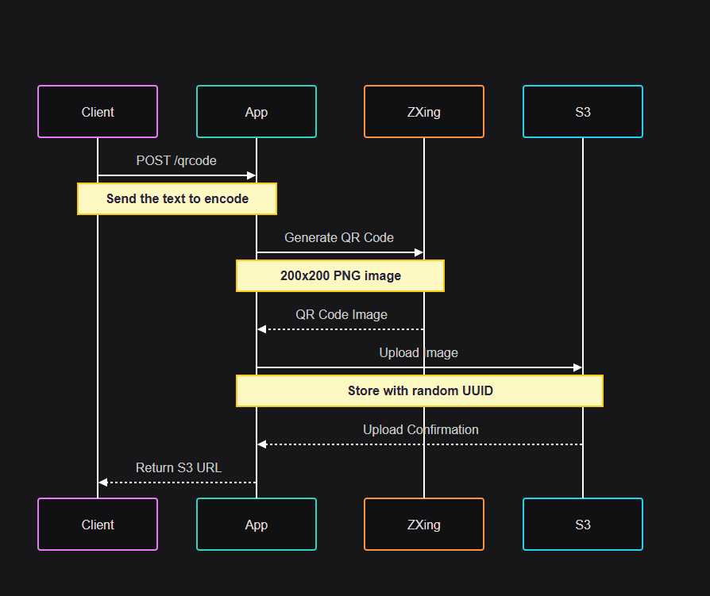

# Gerador de QR Code


Uma aplicação Spring Boot que gera QR Codes e os armazena na AWS S3. Este projeto demonstra a integração da biblioteca ZXing do Google para geração de QR Code e armazenamento na AWS S3.

## 📚 Índice

- Como Usar
- Pré-requisitos
- Variáveis de Ambiente
- Executando a Aplicação
- Desenvolvimento Local
- Deploy com Docker
- Configuração da AWS S3
- Fluxo da Aplicação
- Terminais de API
- Licença

## 📦 Como Usar

Esta seção fornece instruções para configurar e executar a aplicação Geradora de QR Code.

### ✅ pré-requisitos

- Java JDK 21
- Maven
- Docker (opcional)
- Conta AWS com acesso ao S3
- AWS CLI configurado com credenciais

### ⚙️ Variáveis de Ambiente

Crie um arquivo `.env` na raiz do projeto com as seguintes variáveis:

```env 
AWS_ACCESS_KEY_ID=sua_chave_de_acesso
AWS_SECRET_ACCESS_KEY=sua_chave_secreta
AWS_REGION=sua_regiao
AWS_BUCKET_NAME=nome_do_seu_bucket
```
## 🚀 Executando a Aplicação

### 💻 Desenvolvimento Local

1. Crie o arquivo .env como descrito acima

2. Compile o projeto:

```
mvn clean package
```
 
3. Execute a aplicação:

```
mvn spring-boot:run
```
### 🐳 Deploy com Docker

1. Crie a imagem do Docker:
```
docker build -t qrcode-generator:X.X . 
```

Lembre-se de substituir a versão e o nome da imagem se desejar

2. Execute o contêiner:
```
docker run --env-file .env -p 8080:8080 qrcode-generator:X.X
```

Lembre-se de substituir o caminho do arquivo .env pelo caminho do arquivo de ambiente que você criou.

## Configuração AWS S3

1. Crie um bucket S3 na sua conta AWS
2. Atualize o ```AWS_BUCKET_NAME``` no seu arquivo ```.env```ou no comando Docker run
3. Certifique-se de que suas credenciais da AWS tenham permissões apropriadas para acessar o bucket S3

## Fluxo de aplicação

---




## Terminais de API

---

### POST /qrcode

Gere um código QR a partir do texto fornecido e armazene-o no AWS S3. O código QR será gerado como uma imagem PNG com dimensões de 200x200 pixels.

**Parâmetros**

### 📥 Parâmetros da Requisição

| Nome   | Obrigatório | Tipo   | Descrição                                                                 |
|--------|-------------|--------|---------------------------------------------------------------------------|
| `text` | sim         | string | O texto que será codificado no QR Code. Pode ser qualquer valor de texto. |

**Resposta:**

```json
{
   "url": "https://your-bucket.s3.your-region.amazonaws.com/random-uuid"
}
```

**Resposta de erro:**


Se ocorrer um erro durante a geração do código QR ou o upload do S3, a API retornará um erro interno do servidor 500.

**Exemplo de uso:**

```bash
curl -X POST http://localhost:8080/qrcode \
-H "Content-Type: application/json" \
-d '{"text": "https://example.com"}'
```

## Licença

---
Este projeto está licenciado sob a Licença MIT - veja o arquivo LICENSE para mais detalhes.


